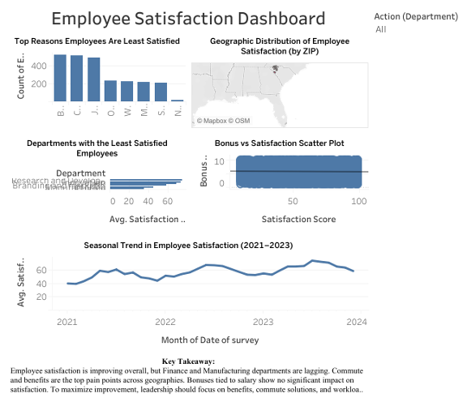

# Employee-Satisfaction-Dashboard (Tableau)

Tableau dashboard analyzing employee satisfaction trends to support data-driven HR decision-making

## Objective
To analyze employee satisfaction trends and provide data-driven recommendations to improve retention and engagement.

## Dashboard Design
The initial layout and planning of the dashboard are shown below:

This design outlines the structure used to answer key business questions related to employee satisfaction.

## Dashboard Link
View here:
[Tableau - Employee Satisfaction Analysis](https://public.tableau.com/app/profile/emmanuel.emedeke/viz/EmployeeSatisfactionAnalysis_17590754034510/InsightsforLeadershipDecision-Making)

## Business Impact
This dashboard helps leadership improve retention by focusing on benefits, commute solutions, and department-level strategies.

## Key Insights
- Employees with lower satisfaction show higher risk of leaving
- Certain departments have lower satisfaction levels
- Work hours and workload impact employee satisfaction trends

## Tools Used
- Tableau Public
- Excel (data preparation)
